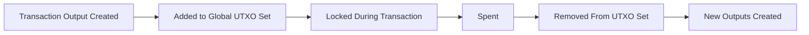
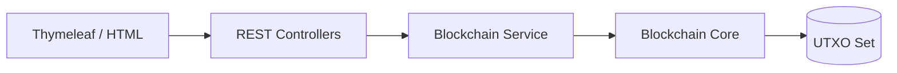

<div align="center">

# ⚡ HEISEI CHAIN  
### A Web-Integrated Java Blockchain for Secure, Tamper-Proof Resource Tracking

</div>

---

## 🌟 What is Heisei Chain?

**Heisei Chain** is a **custom blockchain built entirely in Java**, designed specifically for:

- 🏥 **Disaster relief supply tracking**  
- 🛒 **Inventory flow transparency**  
- 🙌 **Donor contribution traceability**  
- 🔐 **Tamper-proof transaction history**  
- 🌐 **Web-based interaction through Spring Boot**

Unlike typical blockchains that focus on currency,  
**Heisei Chain maps *resources*, *donations*, and *supplies*** using a **UTXO Model** + **ECDSA verification**.  

Every item (rice, medicine, clothes, water, etc.) becomes a **traceable digital token** with:

- its **origin donor**,  
- its **exact quantity**,  
- its **distribution path**,  
- and its **full movement history** across volunteers & camps.

The purpose:  
### ➤ *FULL TRANSPARENCY* in relief operations.

---

## 🔰 Why This Exists

During disaster management, the biggest problems are:

- ❌ No tracking of where donations go  
- ❌ Volunteers may redistribute without accountability  
- ❌ Camps don’t know who donated what  
- ❌ Reports are inaccurate  
- ❌ Manual logging can be manipulated  

**Heisei Chain solves this** by building a blockchain ledger that:

✔ cannot be tampered  
✔ shows 100% traceability  
✔ logs every transfer with signatures  
✔ uses UTXO locking to prevent fraud  
✔ works through a simple web interface  

---

# 🧰 Tech Stack Used

### **Backend Technologies**


### **Blockchain Layer**


### **Web / DevOps**


---

# 🧩 High-Level Architecture

### 🏗️ **System Overview**

```mermaid
flowchart TD
A[User / Web UI] --> B[Spring Boot Controllers]
B --> C[BlockchainService]
C --> D[Blockchain Core]
D --> E[Blocks]
D --> F[Transactions]
F --> G[UTXO Set]
````

---

# 🔗 How Heisei Chain Works (Simplified)

### 1️⃣ **User Registers**

* A wallet (ECDSA keypair) is created
* Role: Donor / Volunteer / Camp Coordinator

### 2️⃣ **Donor Creates Donation (Genesis Transaction)**

* No UTXOs needed
* New commodities enter the system

### 3️⃣ **Volunteer Transfers Goods**

Two-phase confirmation flow:

```mermaid
sequenceDiagram
User->>API: Create Transaction Request
API->>Service: Validate → Store Pending Tx
Service-->>User: TxID Returned

User->>API: Confirm Transaction(TxID + Signature)
API->>Blockchain: Process Transaction
Blockchain->>UTXO: Lock + Update UTXOs
Blockchain-->>User: Success
```

### 4️⃣ **Camp Receives Goods**

* Receives UTXO with donor attribution preserved
* Every split **keeps donor percentage** accurately

---

# 🧱 UTXO Lifecycle Visualization



---

# 🎯 Key Features at a Glance

### ✔ UTXO-Based Commodity Tracking

Each donation is a digital asset.

### ✔ Donor Transparency

Every gram/packet traced back to the donor.

### ✔ Digital Signatures

All transactions signed with ECDSA keys.

### ✔ RSA Encrypted API Flow

Frontend ↔ Backend = RSA encrypted.

### ✔ Real-Time Wallet Views

View volunteer inventory, camp holdings, and distribution charts.

### ✔ Server-Side Reports

Download CSV of all transactions.

---

# 🌐 Web Integration (How the UI Connects)

The blockchain core is **NOT** directly accessed by the UI.
Instead, Spring Boot acts as the bridge:



**Benefits:**

* Clean separation of concerns
* UI never interacts with blockchain classes
* Easy to extend with React/Android/etc later

---

# 📡 API Summary

| Endpoint                                 | Purpose                     |
| ---------------------------------------- | --------------------------- |
| `GET /api/blockchain/display`            | Show blockchain             |
| `GET /api/blockchain/validate`           | Verify chain integrity      |
| `POST /api/blockchain/register`          | Create new wallet           |
| `POST /api/blockchain/creation`          | Stage a transaction         |
| `POST /api/blockchain/confirm`           | Confirm & write transaction |
| `POST /api/blockchain/generateReport`    | Download CSV report         |
| `GET /api/blockchain/displayWallet`      | View volunteer holdings     |
| `GET /api/blockchain/donationPercentage` | View donor stats            |

---

# 🚀 Running the Project

### **Local Run**

```bash
mvn clean package
java -jar target/HeiseiChain-0.0.1-SNAPSHOT.jar
```

### **Docker**

```bash
docker build -t heisei-chain .
docker run -p 8080:8080 heisei-chain
```

---

# 📘 Full Documentation

For extremely detailed internal explanations, class-by-class breakdown, diagrams, UTXO logic, RSA/ECDSA algorithms, and service-layer mapping:

📄 **See the file:**

### 👉 [HEISEI_CHAIN_DOCUMENTATION.md](./HEISEI_CHAIN_DOCUMENTATION.md)

---

